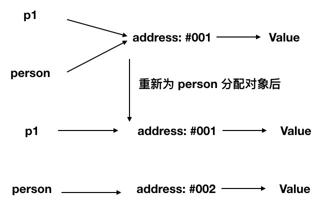
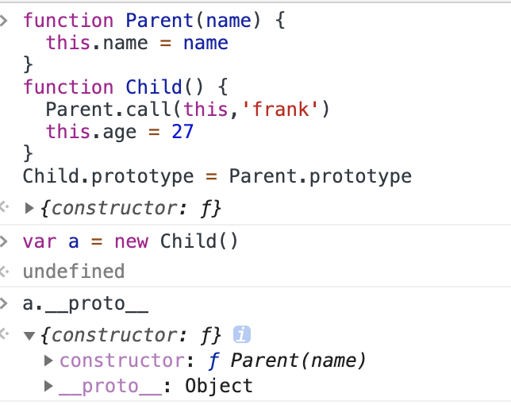
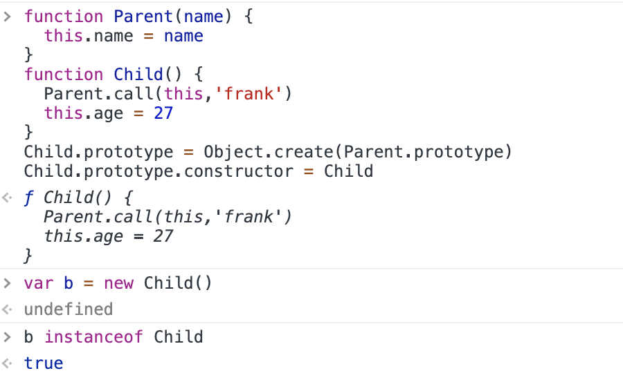

# JS部分基础面试

## 原始类型和对象类型

  1. 原始类型：

  - boolean
  - null
  - undefined
  - number
  - string
  - symbol(ES6新增)

  ::: warning 注意
  为什么说原始类型没有函数可以调用，但`'1'.toString()`却又可以在浏览器中正确执行？
  :::

  因为`'1'.toString()`中的字符串`'1'`在这个时候会被封装成其对应的字符串对象，以上代码相当于`new String('1').toString()`，因为`new String('1')`创建的是一个对象，而这个对象里是存在`toString()`方法的。

  ::: warning 关于null 
  null到底是什么类型？
  :::

  null很多人认为它是个对象类型，但是它是错误的。虽然typeof null会输出object，但是这只是JS存在的一个悠久Bug。在JS的最初版本中使用的是32位系统，为了性能考虑使用低位存储变量的类型信息，000 开头代表是对象，然而null表示为全零，所以将它错误的判断为object。虽然现在的内部类型判断代码已经改变了，但是对于这个Bug 却是一直流传下来。（红宝书中解释是它只是代表一个空指针，指向了0地址，所以才会出现typeof null会输出object。但是它又不是完全的对象。所以当做一个特殊的原始类型来记就可以。）

  2. 对象类型：

  ::: tip 提示
  对象类型和原始类型不同的是，原始类型存储的是值，对象类型存储的是地址（指针）
  :::

  让我们来分析下面的代码块：

  ```js
  var a = [];
  var b = a;
  a.push(1);
  console.log(b); // 输出[1]
  ```

  这里我们将b的地址指向了a，然后我们将a的内容改变，因为a和b都是对象类型，所以b中的结果也是[1]。
  
  - 将对象当成函数参数

  再来分析另一段代码：

  ```js
  function testPerson(person) {
    person.age = 52;
    person = {
      name: '李四',
      age: 18
    }
    return person;
  }
  var p1 = {
    name: '张三',
    age: 23
  }
  var p2 = testPerson(p1);
  console.log(p1.age);  // 输出52
  console.log(p2.age);  // 输出18
  ```
  
  解析步骤：

  首先，`testPerson`方法中，我们将p1的副本传进去，然后我们改变了该副本中的age的值，即52。

  然后我们将这个函数返回了一个新的对象，这个值和原来的p1的值没有任何关系，因为指向了新的地址，所以返回的age的值是18。

  图示如下：

  

## typeof和instanceof

::: tip 提示
typeof用于判断类型，对于基本类型typeof能返回正确的值（除null），对于对象类型只能判断是否是函数还是普通对象。而instanceof判断的是否是某一个类型的实例。
:::

```js
typeof 1 // 'number'
typeof '1' // 'string'
typeof undefined // 'undefined'
typeof true // 'boolean'
typeof Symbol() // 'symbol'
```

typeof对于对象来说，除函数外，都会判断成object。（函数会判断成function）
```js
typeof [] // 'object'
typeof {} // 'object'
typeof console.log // 'function'
```

如果我们想判断一个对象的正确类型，可以用instanceof（内部机制是原型链）
```js
const Person = function() {}
const p1 = new Person()
p1 instanceof Person // true

var str = 'hello world'
str instanceof String // false

var str1 = new String('hello world')
str1 instanceof String // true
```

## 类型转换

1. 转换成布尔值

在转换布尔值的时候，遵循如下转换表进行：

| 数据类型 | 转换为true的值 | 转换为false的值
|:-:|:-:|:-:|
Boolean | true | false |
String | 任何非空字符串 | ""(空字符串) |
Number | 任何非零数字值（包括无穷大）| 0和NaN |
Object | 任何对象 | null(虽然严格说null并不是Object类型) |
Undefined | (不存在这样的值) | undefined

2. 对象转换为原始类型

对象在转换为原始类型的时候，首先会调用`Symbol.toPrimitive`。
  - 如果调用之后该值已经是原始类型，则不需要转换。
  - 如果需要转字符串类型就先调用`toString`，转换为基础类型的话，就返回转换的值。如果不是转字符串类型，那就先调用`valueOf`后调用`toString`。
  - 如果上述都没有转换成基本类型，则报错。

可以覆盖原有的`Symbol.toPrimitive`，调用时优先级最高。

```js
let a = {
  valueOf() {
    return 0
  },
  toString() {
    return '1'
  },
  [Symbol.toPrimitive]() {
    return 2
  }
}
1 + a // => 3
```

3. 四则运算符

加法运算符不同于其他几个运算符，它有如下几个特点：

  - 运算中其中一方为字符串，那么就会把另一方也转换为字符串
  - 如果一方不是字符串或者数字，那么会将它转换为数字或者字符串
  ```js
  1 + '1' // '11',数字被转换成字符串，所以字符串拼接
  true + true // 2，两个布尔值都被优先转化为数字。
  4 + [1,2,3] // "41,2,3"，首先先用valueOf转换[1,2,3]，然而是本身，不是基本类型，然后用toString()，转换之后是字符串"1,2,3"，所以拼接
  ```

还有如下一种特殊情况，包含了一元加运算符。

```js
'a' + + 'b' // -> "aNaN"
```

这里`a`加`(+b)`（可以这样去理解），然而+b并不是一个数字，一元加运算符使用的规则与Number()函数一致，然而这个并不能转成数字，只能转成NaN。所以结果就是aNaN。

除了加法的运算符来说，只要其中有一方是数字，另一方就会转换为数字（吐槽一句，就是加号的字符串拼接搞的鬼）

```js
4 * '3' // 12
4 * [] // 0
4 * [1, 2] // NaN
```

4. 比较运算符
  - 如果是对象，就通过`toPrimitive`转换对象。（上述法则仍然适用，依然是`Symbol.toPrimitive`>`valueOf`>`toString`）
  - 如果是字符串，就通过`unicode`字符索引来比较。

```js
let a = {
  valueOf() {
    return 0
  },
  toString() {
    return '1'
  }
}
a > -1 // true,a是对象，优先通过valueOf转换成0。
```

## this

让我们先看一个例子，从而进行分析：

```js
function foo() {
  console.log(this.a)
}
var a = 1
foo()

const obj = {
  a: 2,
  foo: foo
}
obj.foo()

const c = new foo()
```

让我们逐步进行分析：

  1. 对于直接调用来说，无论`foo`函数被放在什么地方，那么这个`this`一定是`window`（node环境除外）。
  2. 谁调用了函数谁就是`this`，这里面的典型的例子是`obj`，`obj`调用了`foo`函数，那么这个`this`就是`obj`。
  3. 对于`new`的方式来说，`this`永远被绑定在了c上面，不会以任何方式改变this。

上面的情况是对于普通函数的`this`来说的，但是箭头函数有特殊，让我们来看下面的例子：

```js
function a() {
  return () => {
    return () => {
      console.log(this)
    }
  }
}
console.log(a()()())
```

对于箭头函数来说，它的`this`只取决于最后一个非箭头函数的`this`，也就是说它没有自己的`this`，它的`this`完全取决于上级。所以在这个例子里面，`this`自然就是window了。另外`call`，`apply`，`bind`这类改变`this`指向的函数均对箭头函数无效。

对于bind来说，如果进行多次bind，不管我们给函数bind几次，那么它的this指向永远由第一次bind来决定。

```js
let a = {}
let fn = function () { console.log(this) }
fn.bind().bind(a)() // => window
```

首先，`new`的方式优先级最高，接下来是`bind`这些函数，然后是`obj.foo()`这种调用方式，最后是`foo`这种调用方式，同时，箭头函数的`this`一旦被绑定，就不会再被任何方式所改变。

下面的图示会更清楚一些。比较容易帮助理解：


## == 和 ===

==的比较规则比较复杂，可以按照下面的规则来判断，也可以按照[红宝书里面的规则](/JSRedBook/BaseContent.html#操作符)进行判断，都是正确的判断规则。

1. 首先会判断两者类型是否相同。相同的话就是比大小了
2. 类型不相同的话，那么就会进行类型转换
3. null和undefined在作比较之前不能被转换。
4. 判断两者是否是`string`和`number`，是的话就把字符串转换为number再比较。（向上转换）
5. 判断是否有一方为boolean，是的话就把boolean转换为number再比较。
6. 判断有一方是否为Object，且另一方为string、number、symbol，是的话就将Object转换为原始类型再比较。

下面是关于这一个过程的流程图：


## 闭包

闭包的定义其实很简单：函数A内部有一个函数B，函数B可以访问到函数A中的变量，那么函数B就是一个闭包。闭包存在的意义就是让我们间接可以访问函数中的变量。

```js
function A() {
  let a = 1
  window.B = function () {
      console.log(a)
  }
}
A()
B() // 1
```

闭包的几种表现形式：

1. 返回一个函数
2. 作为函数参数传递
3. 回调函数
4. 非典型闭包IIFE（立即执行表达式）

返回一个函数：这种形式的闭包在`JavaScript`的代码编写中，是非常常见的一种方式。
```js
var a  = 1;
function foo(){
  var a = 2;
  // 这就是闭包
  return function(){
    console.log(a);
  }
}
var bar = foo();
// 输出2，而不是1
bar();
```

作为函数参数传递：无论通过何种手段将内部函数传递到它所在词法作用域之外，它都会持有对原始作用域的引用，无论在何处执行这个函数，都会产生闭包。

```js
var a = 1;
function foo(){
  var a = 2;
  function baz(){
    console.log(a);
  }
  bar(baz);
}
function bar(fn){
  // 这就是闭包
  fn();
}
// 输出2，而不是1
foo();
```

回调函数：在定时器、事件监听、`Ajax`请求、跨窗口通信、`Web Workers`或者任何异步中，只要使用了回调函数，实际上就是在使用闭包。

```js
// 定时器
setTimeout(function timeHandler(){
  console.log('timer');
}，100)

// 事件监听
$('#container').click(function(){
  console.log('DOM Listener');
})
```

IIFE：IIFE(立即执行函数表达式)并不是一个典型的闭包，但它确实创建了一个闭包。
```js
var a = 2;
(function IIFE(){
  // 输出2
  console.log(a);
})();
```

下面是一道很经典的关于闭包的面试题：

```js
for (var i = 1; i <= 5; i++) {
  setTimeout(function timer() {
    console.log(i) // 结果输出6次6
  }, i * 1000)
}
```

想让其按序输出1到5，解决方法有三种，第一种是使用闭包：

```js
for (var i = 1; i <=5; i++) {
  (function(j) {
    setTimeout(function timer() {
      console.log(j)
    },j * 1000)
  })(i) // 正如前面所述，IIFE也是一个闭包
}
```

第二种是使用`setTimeout`的第三个参数，第三个参数会传到内部被j接收：

```js
for (var i = 1; i <= 5; i++) {
  setTimeout(
    function timer(j) {
      console.log(j)
    }, i * 1000, i
  )
}
```

第三种是使用`let`(ES6)，也是最为推荐的一种方式：

```js
for (let i = 1; i <= 5; i++) {
  setTimeout(function timer() {
    console.log(i)
  }, i * 1000)
}
```

## 深浅拷贝

1.浅拷贝

可以通过Object.assign()实现一个浅拷贝，浅拷贝的话，会将所有属性拷贝到一个对象中，如果属性值是对象的话，拷贝的是地址，所以并不是深拷贝。对于值类型的属性，改变原有对象并不能影响本身，但是对于对象类型的属性，就会影响。

```js
let a = {
  age: 1
}
let b = Object.assign({}, a)
a.age = 2
console.log(b.age) // 1
```

也可以通过`...`拓展运算符来解决此问题

```js
let a = {
  age: 1
}
let b = { ...a }
a.age = 2
console.log(b.age) // 1
```

当我们遇到对象嵌套的情况，比如我有一个属性里面还是一个对象，那么就要考虑深拷贝。

```js
let a = {
  age: 1,
  jobs: {
    first: 'FE'
  }
}
let b = { ...a }
a.jobs.first = 'native'
console.log(b.jobs.first) // native
```

2. 深拷贝

最常用的深拷贝的解决方案很简单，就是`JSON.parse(JSON.stringfy(object))`。

```js
let a = {
  age: 1,
  jobs: {
    first: 'FE'
  }
}
let b = JSON.parse(JSON.stringify(a))
a.jobs.first = 'native'
console.log(b.jobs.first) // FE
```

但是该方法是具有局限性的：
  - 会忽略 undefined
  - 会忽略 symbol
  - 不能序列化函数
  - 不能解决循环引用的对象

什么是循环引用呢？举个例子就清楚：

```js
let obj = {
  a: 1,
  b: {
    c: 2,
    d: 3,
  },
}
obj.c = obj.b
obj.e = obj.a
obj.b.c = obj.c
obj.b.d = obj.b
obj.b.e = obj.b.c
let newObj = JSON.parse(JSON.stringify(obj))
console.log(newObj) // 会报错，因为这种方法无法处理循环的引用。
```

对于函数、Symbol和undefined也无法正常处理。
```js
let a = {
  age: undefined,
  sex: Symbol('male'),
  jobs: function() {},
  name: 'frank'
}
let b = JSON.parse(JSON.stringify(a))
console.log(b) // {name: "frank"}
```

很多情况，遇到上述无法处理的问题就要自己实现一个深拷贝了。下面代码是目前我认为还比较容易理解，也比较严密的一个深拷贝代码，不过这个方式没有考虑函数进去：

```js
function deepClone (obj = {}, hash = new WeakMap()) {
  if (typeof (obj) !== 'object' || obj == null) { // obj是原始类型或者obj是null，直接返回原值
    return obj
  }
  if (hash.has(obj)) {
    return hash.get(obj) // 处理循环引用，找到对应的值就直接返回
  }
  let result = obj instanceof Array ? [] : {} // 这里判断是否是一个数组，是数组就遍历数组的key，否则是对象的key
  hash.set(obj, result) // 存储hash，便于处理循环引用。
  for (key in obj) { // 循环遍历key值，递归调用拷贝每一层，直到全部遍历完成，返回对象。
    if (obj.hasOwnProperty(key)) {
      result[key] = deepClone(obj[key], hash)
    }
  }
  return result
}
```

另一种写法如下，和上面大同小异，加入了对函数的判别：

```js
function deepClone(obj) {
  function isObject(o) {
    return (typeof o === 'object' || typeof o === 'function') && o !== null
  }

  if (!isObject(obj)) {
    throw new Error('非对象')
  }

  let isArray = Array.isArray(obj)
  let newObj = isArray ? [...obj] : { ...obj }
  Reflect.ownKeys(newObj).forEach(key => {
    newObj[key] = isObject(obj[key]) ? deepClone(obj[key]) : obj[key]
  })
  return newObj
}
```

## 对象和原型

创建对象的三种方式
1. 字面量

```js
var a = { name:'frank', age:27 }
```

2. Object构造函数

```js
var a = new Object();
a.name = 'frank'
a.age = 27
```

3. 利用Object.create()
需要注意的是，如果保持跟上述结果一致，需要将构造函数的原型传入才行，否则只会简单的挂载到该对象的原型上。Object.create是以现有的对象作为新对象的`__proto__`(即原型），详情见MDN上关于Object.create()的定义，说的很清楚明了。所以第三种方式也就出来了。[MDN上关于Object.create的定义](https://developer.mozilla.org/zh-CN/docs/Web/JavaScript/Reference/Global_Objects/Object/create)

```js
var a = Object.create(Object.prototype)
a.name = 'frank'
a.age = 27
```

4. 利用构造函数

```js
function Person(name,age) {
  this.name = name
  this.age = age
}
var a = new Person('frank',27)
```

理解数据属性和访问器属性

刚看到这两个属性新手可能有点懵逼，这是啥？他们都是用来定义对象，可以认为是控制器。下面就来为你揭开这神秘的面纱。

1.  数据属性

  我们通常用的上面的那种字面量赋的属性的值和动态赋值都是用的这里面的value属性，而我们对他的其他几个属性并不了解。下面来科普下：

  - configurable: 表示是否可以用delete来删除属性从而重新定义属性、能否修改对象的属性或者是否把属性改为访问器属性。如果此配置为false，则delete操作无效，非严格模式下啥都不会发生，严格模式下会报错。
  - enumerable: 表示能否通过for-in循环返回属性，如果此配置为false，那就for-in访问不到该属性。
  - writable: 表示能否修改属性的值。如果此配置为false，则此属性不可改。
  - value: 包含这个属性的数据值，也就是我们常用来给予属性的值。读取数据的时候，从这个位置读，写入属性的时候把值保存在这里。

  使用通常的方式（字面量、动态赋值等）给予值的时候，除value外其他三个属性都是true，而使用Object.defineProperty赋值的时候，其他三个属性默认都是false。（如果调用Object.defineProperty只是用来修改已定义属性的值，则没有这样的限制）
  
  而且一旦把属性变成不可配置的，就无法把它再变成可配置的了。

  ```js
  var person = {}
  Object.defineProperty(person,"name",{
    configurable: false,
    value: "frank"
  })
  // 抛错
  Object.defineProperty(person,"name",{
    configurable: true,
    value: "frank" 
  })
  ```

2. 访问器属性：

访问器属性，名如其名，可以控制对象的读和写，是否可以访问。这里有四个属性，当然有两个属性我们前面已经接触过了。

- configurable: 表示是否可以用delete来删除属性从而重新定义属性、能否修改对象的属性或者是否把属性改为访问器属性。如果此配置为false，则delete操作无效，非严格模式下啥都不会发生，严格模式下会报错。
- enumerable: 表示能否通过for-in循环返回属性，如果此配置为false，那就for-in访问不到该属性。
- get：在读取数据的时候调用的函数。默认值undefined。
- set：在写数据的时候调用的函数。默认值undefined。

只指定getter意味着属性不能写，尝试写入属性会被忽略。只指定setter函数的属性也不能读，否则在非严格模式下会返回undefined，严格模式下会抛错。

原型

未完待续...(这部分实在不好写，我还没想好要怎么下笔)

## new一个对象的时候发生了什么

这个直接引用MDN上的回答：

1. 创建一个空的简单JavaScript对象（即{}）；
2. 链接该对象（即设置该对象的构造函数）到另一个对象 ；
3. 将步骤1新创建的对象作为this的上下文 ；
4. 如果该函数没有返回对象，则返回this。


如何自己实现一个new？

```js
function createNew(fn,...args) {
  var o = Object.create(fn.prototype) // 这里创建了一个对象，并将构造函数设置到这个对象的原型上
  var k = fn.apply(o,args) // 改变this指向，并返回一个值
  return typeof k === 'object' ? k : o // 确定该值是否是一个对象，如果是的话，那就返回，如果不是，说明原构造函数有返回值。
}
function Person(name) {
    this.name = name
}
var a = createNew(Person,'frank') // a:{name:"frank"}
```

## 继承

实际上继承的根本原理就是原型链。大体上分为构造函数继承和原型链继承两种方式。

1. 最原始的构造函数继承

```js
function Parent(name) {
  this.name = name
}
function Child() {
  Parent.call(this,'frank')
  this.age = '27'
}
```

这里我们使用了`call`改变了构造函数的`this`指向，使得父级构造函数得以继承。然后我们又附加了自己的属性。但是这样有一个弊病就是`Parent`构造函数在原型链上的内容无法继承过来。

2.最原始的原型链继承

```js
function Parent(name) {
  this.name = name
}
function Child() {
  this.age = '27'
}
Child.prototype = new Parent('frank')
```

这里我们给了函数的原型指向了一个新的`Parent`对象，使得原型挂载了该对象的值。但是原型有一个弊病就是，原型上的内容是公用的，如果拥有相同`Parent`构造函数的对象做了改变，那么其他的也会受影响。

那么上面的两种方式各自解决了不同的问题，也各自有难以解决的痛点，那么把他俩一结合不就完了么。对，所以组合继承来了：

组合继承

```js
function Parent(name) {
  this.name = name
}
function Child() {
  Parent.call(this,'frank')
  this.age = 27
}
Child.prototype = new Parent()
```

组合继承解决了构造函数和原型链上的内容继承，但是组合继承也有一定的弊病，Parent构造函数被调用了两次。所以下面是针对组合继承的改良

组合继承的改良1

```js
function Parent(name) {
  this.name = name
}
function Child() {
  Parent.call(this,'frank')
  this.age = 27
}
Child.prototype = Parent.prototype
```

这样倒是避免了重复调用的问题，提升了性能。但是在判断由`Child`构造函数new出来的对象的时候会发生判断类型的错误：


在这里我们可以看到该对象原型的`constructor`是`Parent`而不是`Child`，意味着`instanceof`操作符失效，无法正确的判断这个是`Child`的实例。所以稍微构想了下，我们就有如下的解决方案。

组合继承的改良2（最终方案）
```js
function Parent(name) {
  this.name = name
}
function Child() {
  Parent.call(this,'frank')
  this.age = 27
}
Child.prototype = Object.create(Parent.prototype)
Child.prototype.constructor = Child
```

在这里我们用了`Object.create`去新建了一个对象，用来指向该构造函数的原型，然后我们将原型的`constructor`手动指回`Child`构造函数，那么这样的话，类型判断就正确了。



## 作用域和作用域链

1. 作用域

在JavaScript中，分为两种作用域：全局作用域和函数作用域。

全局作用域：在代码任何的位置都可以访问。

函数作用域：只限于在函数的内部访问，函数执行结束之后被销毁。

作用域的最大好处就是隔离变量，不同作用域下的同名变量不会有冲突（尽管如此，我们仍然建议不要用相同的名字的变量）

2.作用域链

一般情况下，变量取值到创建这个变量的函数的作用域中取值。但是如果在当前作用域中没有查到值，就会向上级作用域去查，直到查到全局作用域，这么一个查找过程形成的链条就叫做作用域链。(先直接盗图了，这个画的比较清晰)


