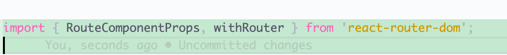
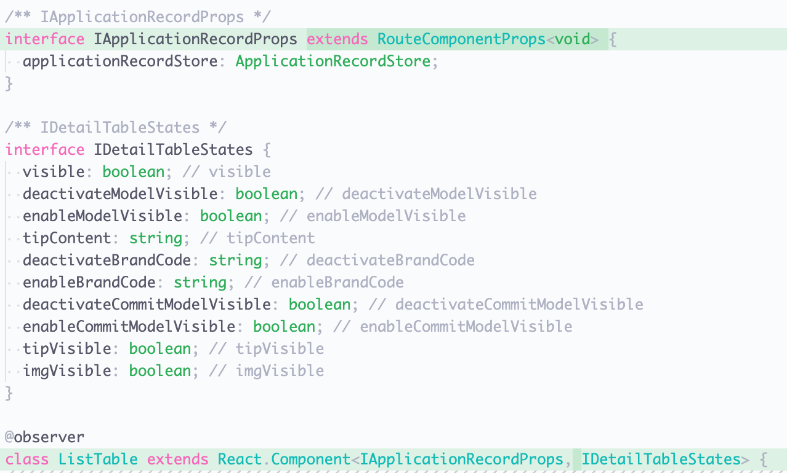
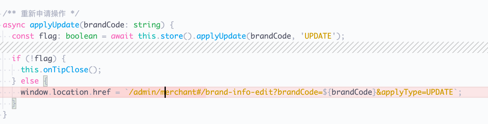
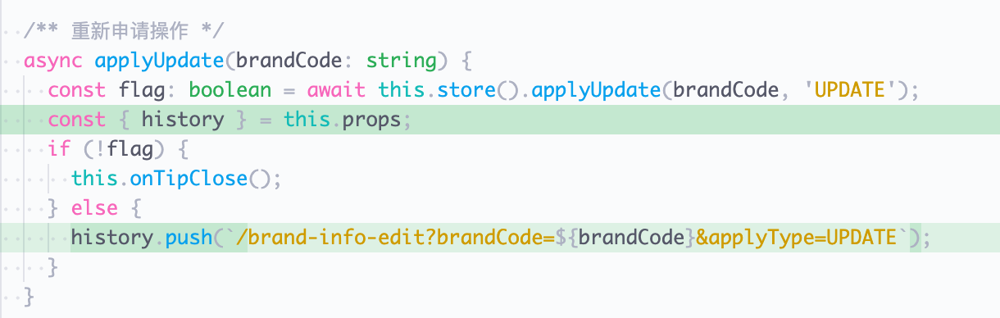
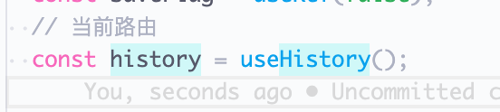
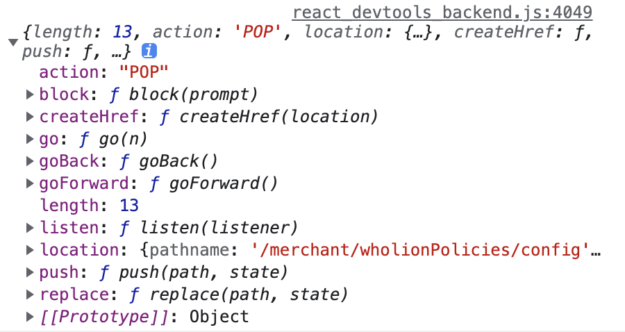
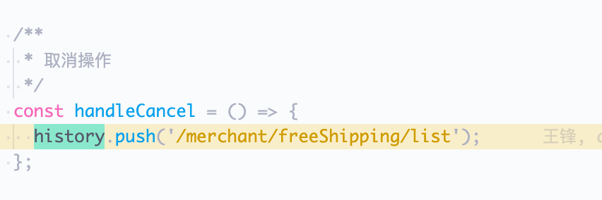
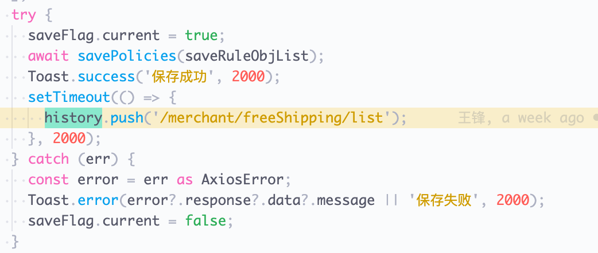
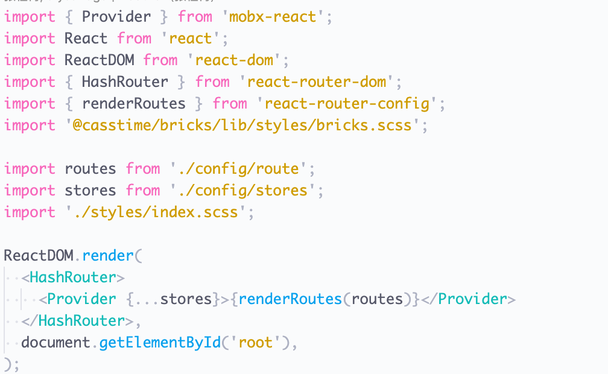

# 从项目切入，浅谈Router、WithRouter、useHistory等React-Hooks的爱恨情仇

## 为何想写这篇博文？

在我们组内的开发中，看到我们的现有的路由跳转的方式，清一色的都是使用window.location.href。这种方式对于调试不够友好（在开发环境下必须要加前缀，而本地调试的时候又必须要手动去掉前缀，例如我们组的卖家中心项目就是/seller#/，而这样是代理到了代理环境，而不是开发环境本身。都说React是有三件套的，React、React-Router、Redux（以及Mobx等为代表的其它状态管理工具）。然而在我们项目中，用React-Router进行路由跳转的方式为之甚少。所以这引发了我的兴趣，便想把这个查清楚一些。

## 对于已有的window.location.href问题要怎么解决？

首先需要声明一个范围（免责声明），只对于同一个项目中的页面可以这么跳，其它的不适用React-Router的跳转。

如果有上面的免责声明的限制，那么我们就可以对已有的项目进行如下改造。下面分两种情况进行讨论：

- 如果是类组件，使用WithRouter

WithRouter是一个高阶组件，它会把类组件包装成一个高阶组件，在原来的基础上添加react-router的match、history、location三个对象到我们的类组件中。这样对于我们层级较深的，没有直接和外层路由相连的组件，我们也可以直接对其进行路由操作。

下面我们举例子来看这个的用法：

1.首先，我们要把withRouter和RouterComponentProps导入进来。



2.其次，我们要改变类组件的声明。



3.再次，**是我们的核心**。我们要使用这个来进行路由跳转方式的替换。




4.最后，使用WithRouter形成一个高阶组件


注：withRouter的使用范围有两个限制。第一个是类组件，只有在类组件中才能使用。第二个是不直接与主页面的路由相连，才需要用withRouter高阶组件。如果当前的组件有Router，则直接使用Router即可，不需要用WithRouter添加路由对象进去。

- 如果是函数组件，使用useHistory

React在16.8版本后推出了React Hooks，所以我们又多了一种写组件的方法。与之对应，我们也要对路由跳转的方法进行变更，所以useHistory横空出世。

下面我们来看看useHistory在函数组件中是怎么使用的。

1.首先我们引入useHistory


2.我们可以在函数组件声明一个对象，用来获取当前的路由。我们可以看一下这个对象里面有什么。




3.获取到这个路由对象我们就可以全局来进行使用。如下是两个使用示例，也可以结合hooks来进行使用。




## 从项目整体切入，看看我们的Router是怎么运作的

从我们的项目来看，都用的是哈希路由（即HashRouter)。比如差不多是这样的一个结构。



这里我们不免对HashRouter的内部构造有一些兴趣，于是我们打开它的内部构造，结果发现了更玄妙的东西。这里就不得不提到BrowserRouter和HashRouter，react-router对它们的不同的处理方式。

以下代码只保留了主干部分。这里我们可以看到它们的代码结构几乎一模一样。都使用了history这个库，通过传入的history方法来判断是BrowserRouter还是HistoryRouter。那么我们分两个部分展开去讲。分别分析Router组件和简单看一下createBrowserHistory和createHashHistory给我们带来了什么特性。
BrowserRouter源码：
```js
import React from "react";
import { Router } from "react-router";
import { createBrowserHistory as createHistory } from "history";

class BrowserRouter extends React.Component {
  history = createHistory(this.props);

  render() {
    return <Router history={this.history} children={this.props.children} />;
  }
}
export default BrowserRouter;
```

HashRouter源码：

```js
import React from "react";
import { Router } from "react-router";
import { createHashHistory as createHistory } from "history";

class HashRouter extends React.Component {
  history = createHistory(this.props);

  render() {
    return <Router history={this.history} children={this.props.children} />;
  }
}

export default HashRouter;
```

Router源码
```js
import React from "react";

// 这两个只是提供一个普通的上下文，用来创建一个Context而已，都调用了createNamedContext这个方法。用于向下传递共享的属性
import HistoryContext from "./HistoryContext.js";
import RouterContext from "./RouterContext.js";

/**
 * Router就是记录路由状态的context
 */
class Router extends React.Component {
  static computeRootMatch(pathname) {
    return { path: "/", url: "/", params: {}, isExact: pathname === "/" };
  }

  constructor(props) {
    super(props);
    // 初始状态值是通过传入的history对象来拿到的。
    this.state = {
      location: props.history.location
    };

    // This is a bit of a hack. We have to start listening for location
    // changes here in the constructor in case there are any <Redirect>s
    // on the initial render. If there are, they will replace/push when
    // they mount and since cDM fires in children before parents, we may
    // get a new location before the <Router> is mounted.
    // 因为子组件会比父组件更早渲染完成, 以及<Redirect>的存在, 若是在<Router>的
    // componentDidMount生命周期中对history.location进行监听, 则有可能在监听
    // 事件注册之前, history.location已经由于<Redirect>发生了多次改变, 因此我们
    // 需要在<Router>的constructor中就注册监听事件
    this._isMounted = false; // 设定了加载完毕的状态
    this._pendingLocation = null; // 是否是在读取中的路由

    if (!props.staticContext) { // 这里其实BrowserRouter和HashRouter都走这里，它们都不是静态上下文
      this.unlisten = props.history.listen(location => { // 这里根据传入的history不同，调用他们的listen方法
        if (this._isMounted) { // 读取状态完毕后，就设置跳转路由
          this.setState({ location });
        } else {
          this._pendingLocation = location; // 否则就暂时搁置，存一下
        }
      });
    }
  }

  componentDidMount() {
    this._isMounted = true; // 加载完成的时候，就设置已经加载状态为true

    if (this._pendingLocation) { // 如果有暂存的位置，就设置这个路由位置。
      this.setState({ location: this._pendingLocation });
    }
  }

  componentWillUnmount() {
    if (this.unlisten) {
      // 其实这里是我觉得很精髓的一个地方
      // 这个源码考虑到了两种情况
      // 可能路由卸载加载成功了，然后location也成功的变化了，那就是走上面的this._isMounted为true的情况
      // 也有可能是还没有加载的时候（比如第一次），然后这个路由就会被记录，然后这个时候这个记录就存在了
      // 然后当这个记录存在，走mounted的时候，就可以成功被设置
      // 有点相辅相成的意思
      this.unlisten();
      this._isMounted = false;
      this._pendingLocation = null;
    }
  }

  render() {
    return (
      <RouterContext.Provider
        value={{
          history: this.props.history,
          location: this.state.location,
          match: Router.computeRootMatch(this.state.location.pathname),
          staticContext: this.props.staticContext
        }}
      >
        <HistoryContext.Provider
          children={this.props.children || null}
          value={this.props.history}
        />
      </RouterContext.Provider>
    );
  }
}

export default Router;
```